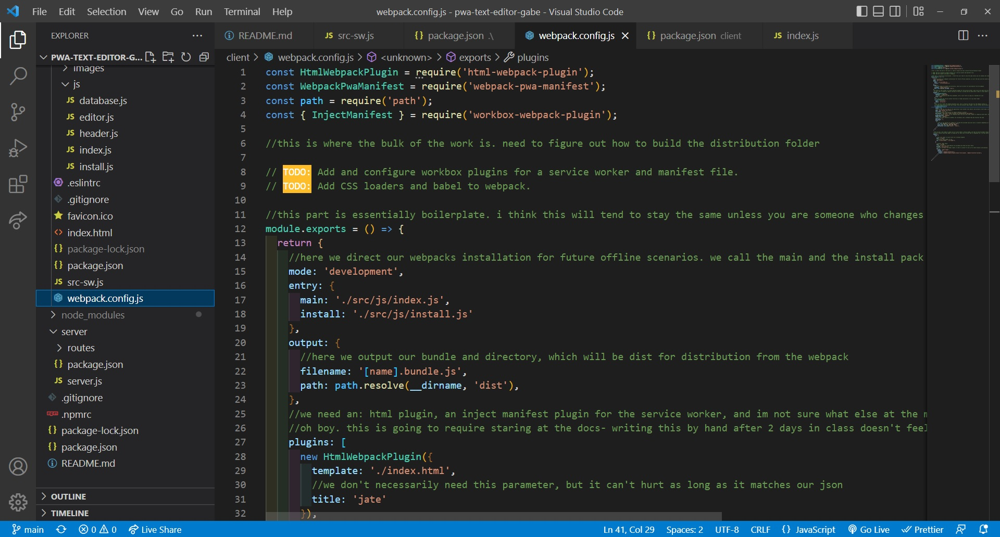
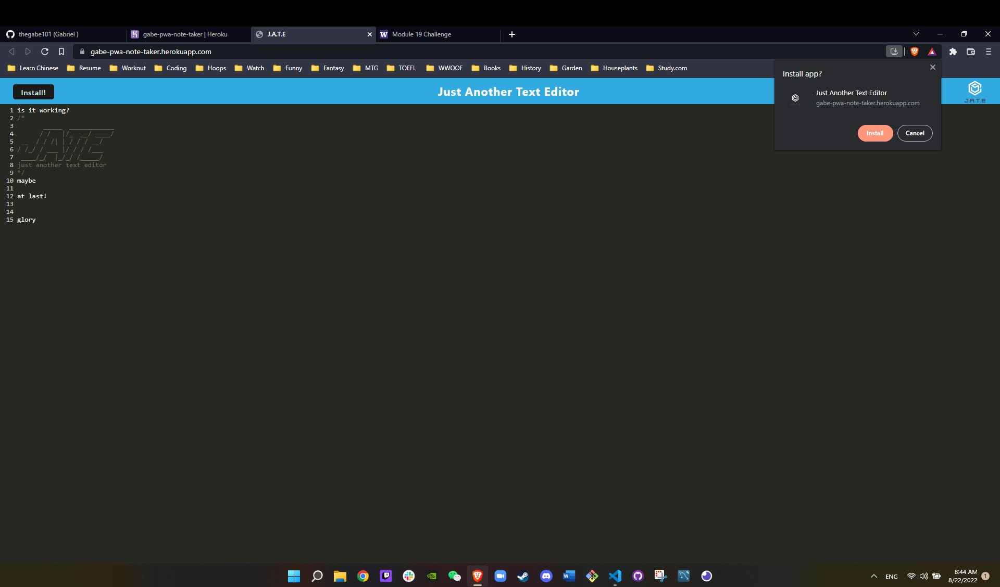
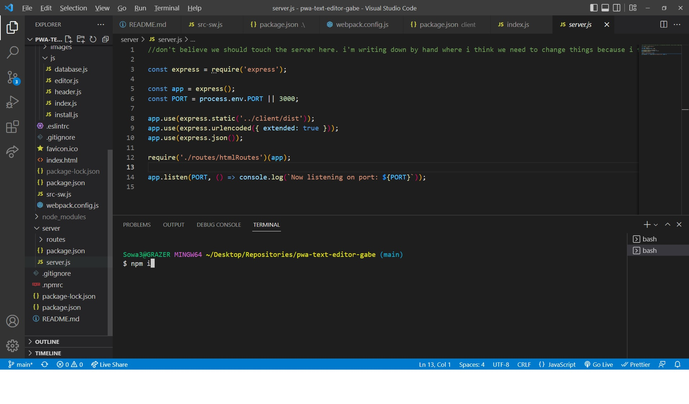
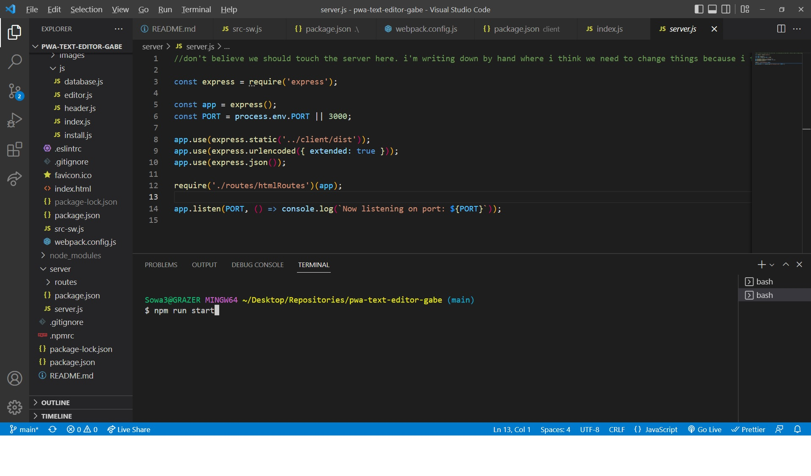
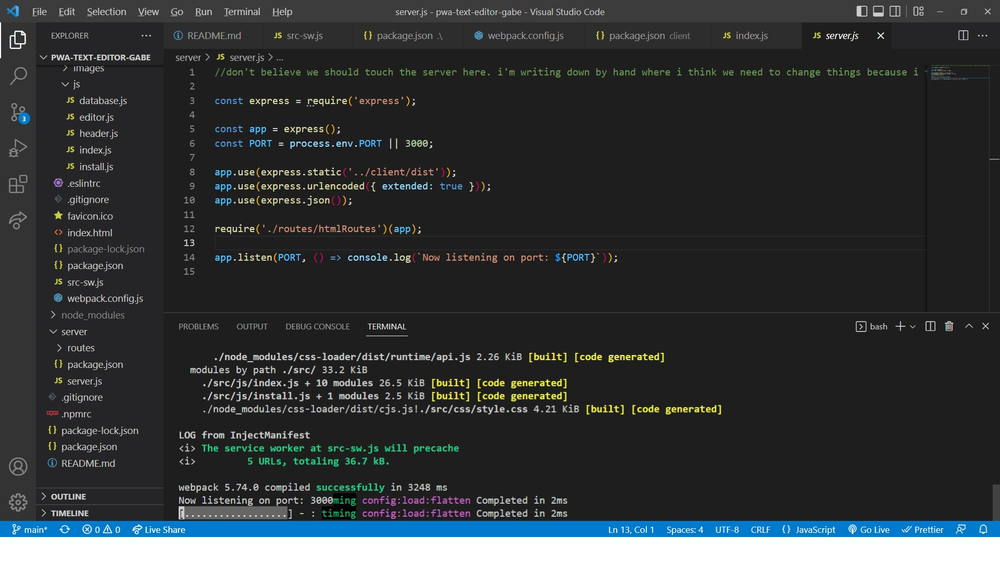
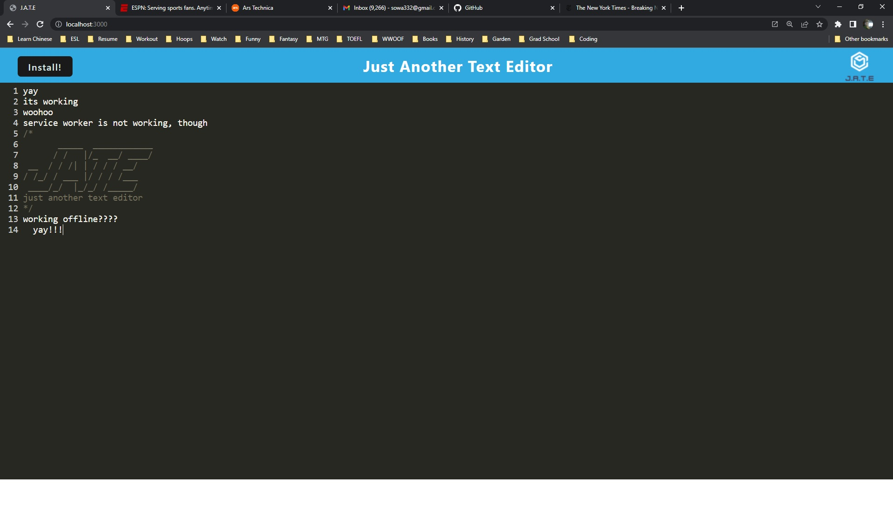
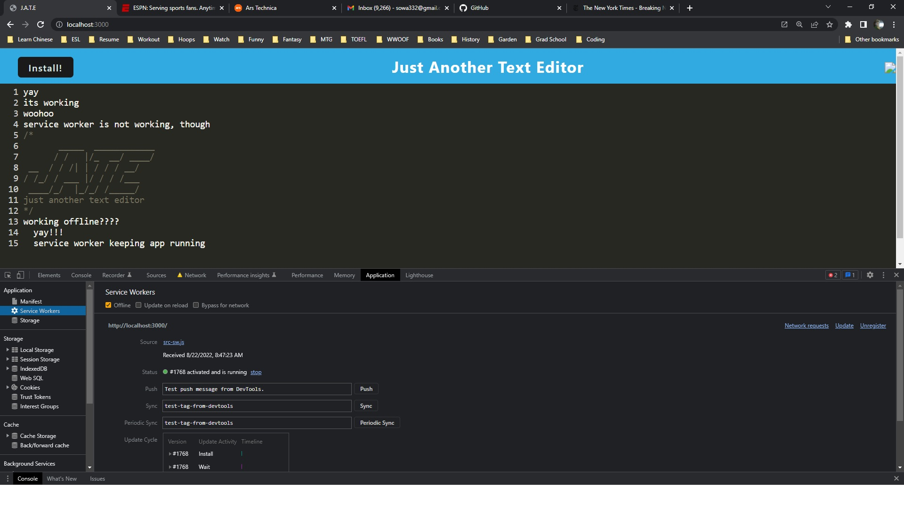

# pwa-text-editor-gabe

# Heroku Deployed App: https://gabe-pwa-note-taker.herokuapp.com/

## Table of Contents

- [Description](#description)
- [Installation](#installation)
- [Usage](#Usage)
- [Bugs](#Bugs)
- [Screenshots](#screenshots)
- [Credits](#credits)

## Description

This project involved refactoring code to create a Progressive Web App that could run offline. An app needs to fulfill several qualifications to be considered a PWA, all of which this does: it should contain manifest JSON files and a service worker, it should run offline, and it should be highly responsive and fast given it is running locally. Preferably, it will achieve its speed by caching its static assets (such as its images, JS files, etc.) and retrieving them there.

- The motivation for creating this project was beginning the learning process for PWA's, an entire submethod (and a conceptual one at that) of coding that asks developers to build from the ground up with accessibility, consistency, speed, and flexibility in mind. This assignment in particular asked us to refactor an existing app to allow to it work offline, an important aspect of any PWA. The advantages of an app working offline are many- speed, accessibility from anywhere, and instant syncing with the cloud once the app returns online.
- While I built this project mainly to get practice with the skills we are working on in class, our PWA unit was relatively short, so I had minimal experience with it. Conceptually, PWAs make a lot of sense to me, so I was excited to dive in. As an Android user and Google fan, I appreciate the environment PWAs are often built in and what Google primarily wants to accomplish with the concept. I found that there was a significant amount of odd keywording and language involved in service worker, cacheing, and webpack code, so the project required more googling than usual. An invaluable resource was our completed mini-project from class. I would have been entirely lost without it; it gave me a good base of things to google in an effort to understand what it is I required and why I was writing it.
- This is a useful project in that it provides a user with an app that can run both online and off and has real-world utility. A user can use JATE to write and keep notes in any situation.
- This project was an unusually difficult one in that it exposed me to a bunch of new language that is rather niche in that it isn't used in front or traditional back-end; instead I was looking up specific lines of code that are used mainly in the mirroring of an application offline that is already working offline. Figuring out how to get my service worker running was especially tricky, and I had a problem for some time turning it off to get localhost:3000 available on my machine again. All in all it was a fun project that felt very different from anything else we'd done in class thus far.

## Installation

- One can run this note taking app in two manners: locally, or over a network. In order to run the program locally, a user must:

- First make sure they have all of this code in a folder on their machine. Without the repository, a local runtime environment will fail.

- The user must open a node/clp and run "npm install." Doing so will ensure all packages and dev packages are installed.

- In the root folder, the user can then run "npm run build" in order to build the webpack and serve the entire client folder locally; they would then need to run the server (localhost3000) by cding to the server and running the server as a node using node server.js. Alternatively, the user can combine these steps by running "npm run start:dev," which will build the webpack, start the service worker, and run the server.

- Should a user want to use this application over the web, they may simply navigate to its deployed heroku web link at: https://gabe-pwa-note-taker.herokuapp.com/

## Usage

- Using the application online or offline is quite simple. A user can enter text on any line and it should be there when they return to add or remove notes later.

## Bugs

- There are no known major bugs afflicting the program at this time.

## Screenshots

- 
- 
- 
- 
- 
- 
- 

## Credits

- This project could not have been completed without the hardwork and excellent advice of my educators at UW Fullstack and tutor, Jacob Carver.
